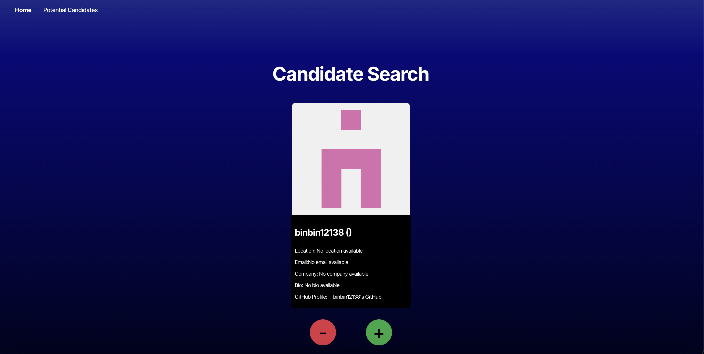
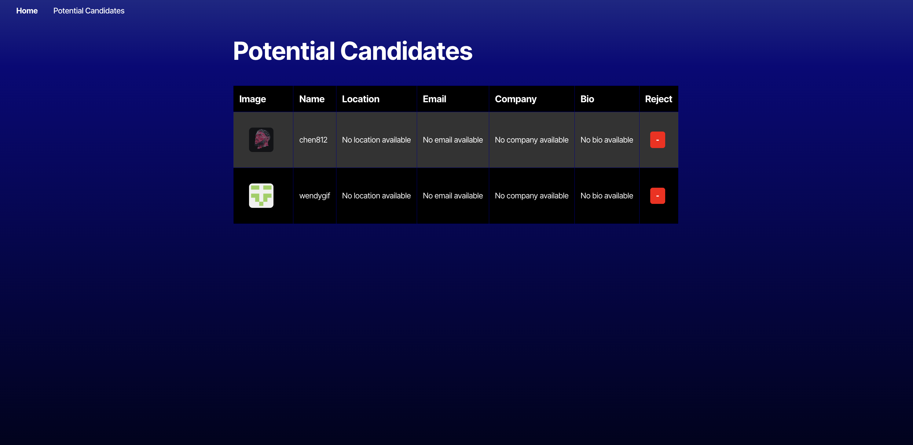

# Candidates Search App 👩‍💻👨‍💻

The **Candidates Search App** allows users to search for candidates based on a query, view detailed information about each candidate, and save candidates of interest for future access. The app is designed to be responsive, working seamlessly on both mobile and desktop devices.

## Table of Contents

- [Description](#description)
- [Installation](#installation)
- [Usage](#usage)
- [Build the Project ](#build-the-project)
- [Deployment](#deployment)
- [Deployed Application](#deployed-application)
- [Screenshots](#screenshots)
- [Technologies Used](#technologies-used)
- [License](#license)
- [Contributing](#contributing)

## Description

This **Candidates Search App** allows users to:

- View detailed information about candidates, such as experience, location, and skills.
- Save candidates to a "favorites" list for easy access.
- Use data from an external API to fetch candidate information.

## Installation

### Clone the Repository

1. Clone the repository to your local machine:

```bash
   git clone https://github.com/ThayRibeiro0/candidates-search-app.git
```

2. Navigate to the project directory:

```bash
    cd candidates-search-app
```

3. Install the dependencies:

To install the necessary dependencies for the frontend, run:

```bash
    npm install
```

This will install all dependencies listed in package.json.

## Usage

Running the App Locally

To run the application locally, use the following command to start the development server:

```bash
 npm run start:dev
```

This will start the development servers for both the frontend (React) and the backend (Node.js). The client-side application will be available at http://localhost:3000, and the server will be running at http://localhost:3001.

## Build the Project

To build the project for production, run:

```bash
 npm run build
```

This will compile and bundle the frontend code for production use.

## Deployment

To deploy the application, you can follow these steps:

- Push your changes to GitHub.
- Connect your repository to a deployment platform, such as Render: Render.com
- Set the build command to npm run render-build.
- Set the start command to npm run start.
  
## Deployed Application

Check out the live version of the app here: [Live Version](https://candidatesearchapp1.onrender.com/)

### 📸 Screenshots

<div>
  
  
</div>

## Technologies Used

React.js, Node.js, Express.js, External API to search candidates (e.g., GitHub API or another source), TypeScript, npm and nodemon.

## License

This project is licensed under the MIT License. See the LICENSE file for more information.

## Contributing

Contributions are welcome! If you find any issues or have suggestions for improvements, please open an issue or submit a pull request on the GitHub repository.
